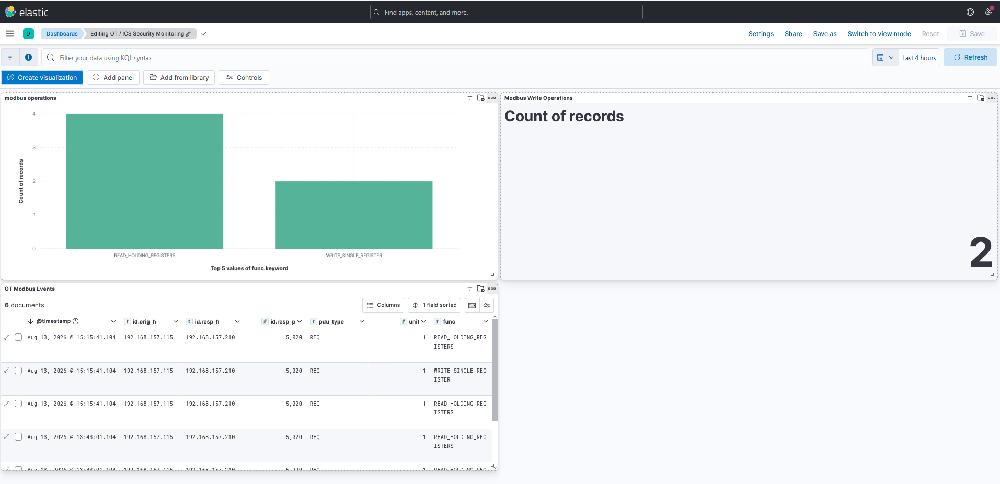
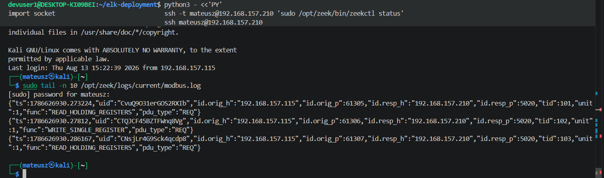
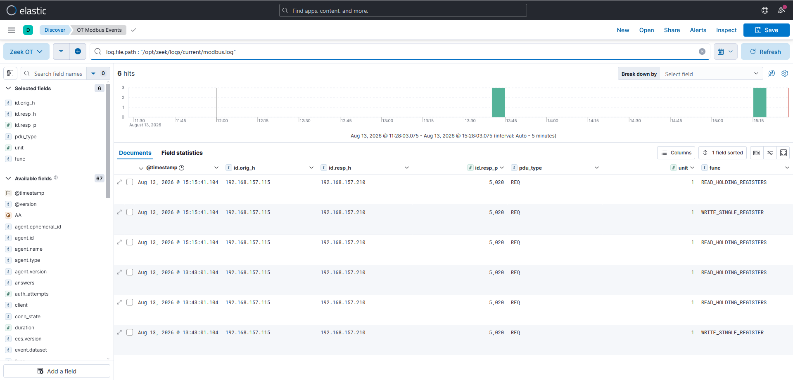
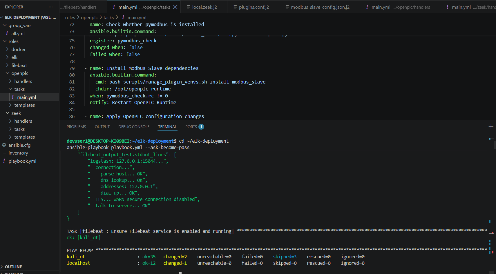
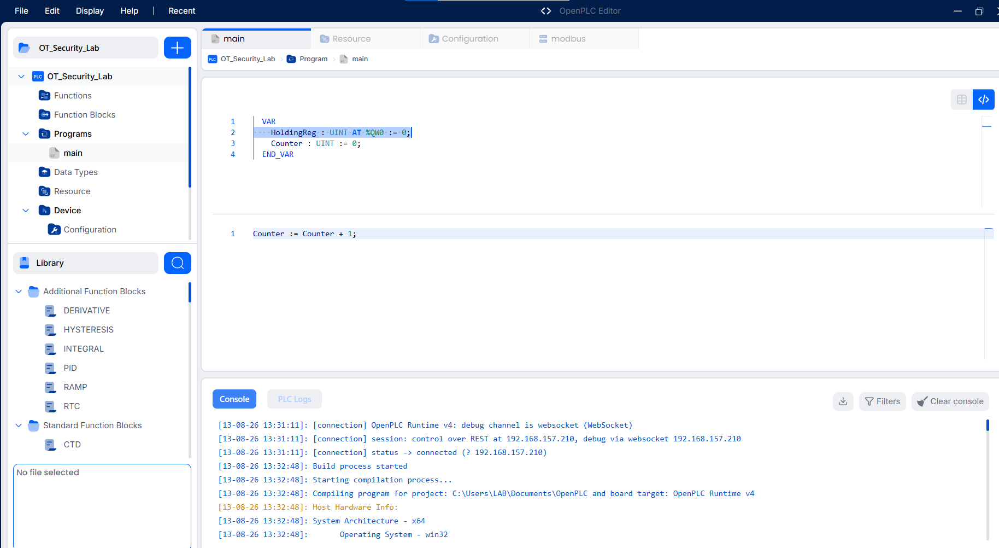
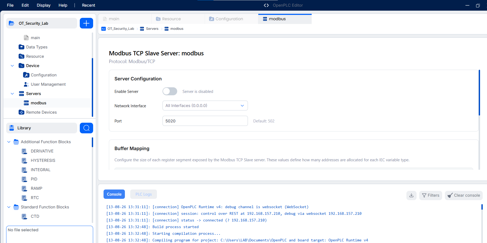

# OT/ICS Monitoring Lab with ELK and Ansible

An educational OT/ICS laboratory that automates the deployment of a monitoring environment using Ansible, Docker, ELK, Zeek, Filebeat and OpenPLC.

The project simulates Modbus/TCP communication with an industrial controller, monitors network traffic with Zeek and forwards the generated events to Elasticsearch for analysis and visualisation in Kibana.

## Architecture


## Components

- **Ansible** - automated installation and configuration
- **OpenPLC** - simulated industrial controller
- **Modbus/TCP** - industrial communication protocol used in the lab
- **Zeek** - passive monitoring and analysis of Modbus/TCP traffic
- **Filebeat** - collection and forwarding of Zeek logs
- **Logstash** - log ingestion and processing
- **Elasticsearch** - event storage and indexing
- **Kibana** - event analysis and visualisation
- **Docker Compose** - deployment of the ELK stack

## Requirements

- Ansible control machine
- Linux host for the ELK stack
- Linux OT endpoint accessible through SSH
- Docker and Docker Compose
- Ansible collections `community.docker` and `ansible.posix`

## Configuration

1. Set the ELK server and OT endpoint addresses in `inventory`.
2. Set the monitored network interface and network range in `group_vars/all.yml`.
3. Verify the Filebeat-to-Logstash connection settings in `group_vars/all.yml`.

## Deployment

Install the required Ansible collections:

```bash
ansible-galaxy collection install community.docker ansible.posix
```

Run the playbook:

```bash
ansible-playbook -i inventory playbook.yml --ask-become-pass
```

## SSH tunnel for log forwarding

The OT endpoint forwards Zeek events with Filebeat to:

```text
127.0.0.1:15044
```

During the lab, this port was forwarded through an SSH tunnel to the Logstash Beats input running on the monitoring host on TCP port `5044`.

This approach was used because the laboratory consisted of separate virtual and WSL environments.

The resulting log pipeline was:

```text
Zeek
  ↓
Filebeat
  ↓
SSH tunnel
  ↓
Logstash
  ↓
Elasticsearch
  ↓
Kibana
```

## Results

### OT/ICS monitoring dashboard

The final Kibana dashboard presents Modbus/TCP activity collected from the laboratory environment. It includes a breakdown of Modbus operations, the number of write operations and a table of captured OT events.



### Modbus/TCP traffic detected by Zeek

Zeek parses Modbus/TCP traffic generated between the test client and OpenPLC. The `modbus.log` output shows industrial protocol operations such as `READ_HOLDING_REGISTERS` and `WRITE_SINGLE_REGISTER`.



### Modbus events in Kibana Discover

Zeek JSON events are collected by Filebeat, forwarded through Logstash and indexed in Elasticsearch. Kibana Discover provides access to the resulting Modbus events and fields such as source host, destination host, destination port, PDU type, unit identifier and Modbus function.



### Automated deployment with Ansible

The Ansible playbook installs and configures the monitoring components on the ELK host and OT endpoint. The deployment includes OpenPLC Runtime, Zeek, Filebeat and the containerised ELK stack. The final play recap confirms successful execution of the laboratory deployment.



### OpenPLC test program

OpenPLC Runtime is used as the simulated industrial controller. The test Structured Text program exposes a holding register and uses a simple counter to provide process data for Modbus/TCP communication tests.



### OpenPLC Modbus/TCP configuration

The laboratory uses Modbus/TCP on TCP port `5020`. The runtime Modbus slave is configured through the OpenPLC plugin configuration deployed by Ansible.

The screenshot below shows the OpenPLC Modbus configuration view used during laboratory testing.



## Project status

The current version demonstrates:

- automated OT monitoring environment deployment
- simulated PLC communication using Modbus/TCP
- passive industrial protocol monitoring with Zeek
- parsing of Modbus operations such as register reads and writes
- forwarding of OT telemetry through Filebeat and Logstash
- storage and indexing of OT events in Elasticsearch
- analysis and visualisation of industrial network activity in Kibana
- use of an SSH tunnel to connect separate laboratory environments

Further development will focus on detecting suspicious Modbus write operations and modelling a simple industrial process.
