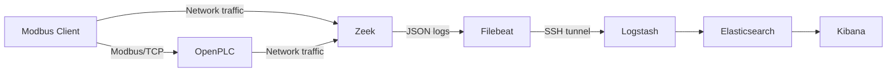

# OT/ICS Monitoring Lab with ELK and Ansible

An educational OT/ICS laboratory that automates the deployment of a monitoring environment using Ansible, Docker, ELK, Zeek, Filebeat and OpenPLC.

The project simulates Modbus/TCP communication with an industrial controller, monitors network traffic with Zeek and forwards the generated events to Elasticsearch for analysis and visualisation in Kibana.

## Architecture



## Components

- **Ansible** - automated installation and configuration
- **OpenPLC** - simulated industrial controller
- **Modbus/TCP** - industrial communication protocol used in the lab
- **Zeek** - passive monitoring and analysis of Modbus/TCP traffic
- **Filebeat** - collection and forwarding of Zeek logs
- **Logstash** - log ingestion and processing
- **Elasticsearch** - event storage and indexing
- **Kibana** - event analysis and visualisation
- **Docker Compose** - deployment of the ELK stack

## Requirements

- Ansible control machine
- Linux host for the ELK stack
- Linux OT endpoint accessible through SSH
- Docker and Docker Compose
- Ansible collections `community.docker` and `ansible.posix`

## Configuration

1. Set the ELK server and OT endpoint addresses in `inventory`.
2. Set the monitored network interface and network range in `group_vars/all.yml`.
3. Verify the Filebeat-to-Logstash connection settings in `group_vars/all.yml`.

## Deployment

Install the required Ansible collections:

```bash
ansible-galaxy collection install community.docker ansible.posix
```

Run the playbook:

```bash
ansible-playbook -i inventory playbook.yml --ask-become-pass
```

## SSH tunnel for log forwarding

The OT endpoint forwards Zeek events with Filebeat to:

```text
127.0.0.1:15044
```

During the lab, this port was forwarded through an SSH tunnel to the Logstash Beats input running on the monitoring host on TCP port `5044`.

This approach was used because the laboratory consisted of separate virtual and WSL environments.

The resulting log pipeline was:

```text
Zeek
  ↓
Filebeat
  ↓
SSH tunnel
  ↓
Logstash
  ↓
Elasticsearch
  ↓
Kibana
```

## Results

### OT/ICS monitoring dashboard

Modbus/TCP operations collected by Zeek and visualised in Kibana.


### Modbus/TCP traffic detected by Zeek

Zeek identifies industrial protocol operations including `READ_HOLDING_REGISTERS` and `WRITE_SINGLE_REGISTER`.


### Modbus events in Elasticsearch

Zeek events forwarded through Filebeat and Logstash are available for analysis in Kibana Discover.


### Automated deployment with Ansible

Ansible installs and configures the ELK stack and OT monitoring components.


### OpenPLC test program

OpenPLC Runtime is used to simulate an industrial controller and expose process variables through Modbus/TCP.


### OpenPLC Modbus configuration

The laboratory uses a Modbus/TCP slave running on TCP port `5020`.


## Project status

The current version demonstrates:

- automated OT monitoring environment deployment
- simulated PLC communication using Modbus/TCP
- passive industrial protocol monitoring with Zeek
- collection of Modbus operations such as register reads and writes
- forwarding of OT telemetry to the Elastic Stack
- analysis and visualisation of industrial network activity in Kibana

Further development will focus on detecting suspicious Modbus write operations and modelling a simple industrial process.
